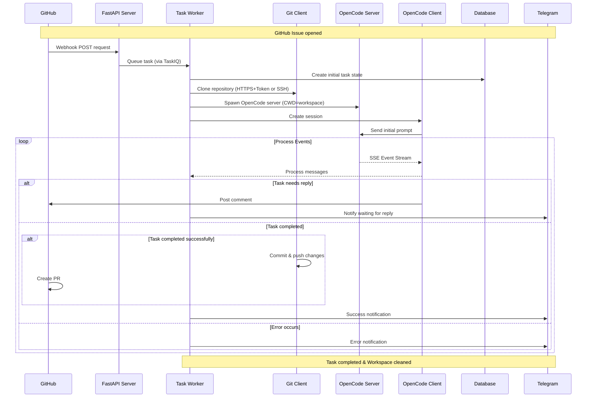
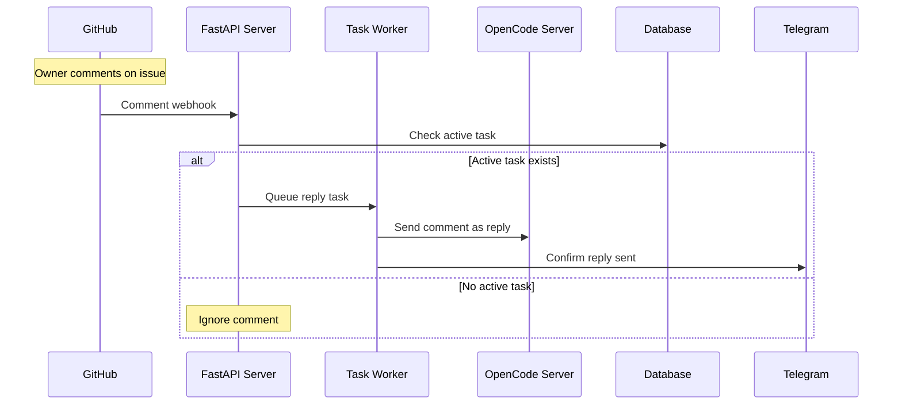
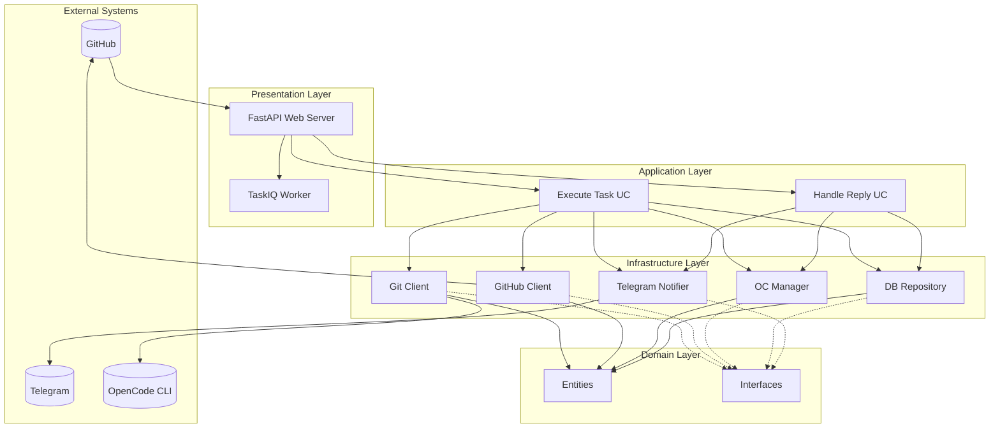
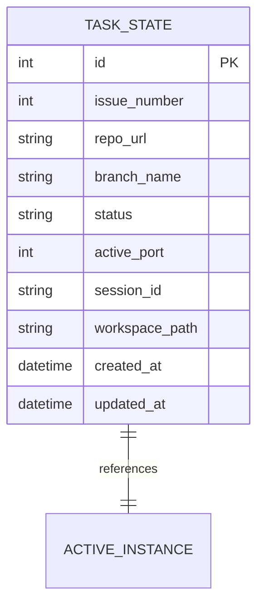

# AI Coding Agent Orchestrator - Project Structure

## Overview

The AI Coding Agent Orchestrator is an asynchronous Python service that acts as a bridge between GitHub, Telegram, and isolated instances of the OpenCode agent. The system is designed to automate responses to GitHub issues by spawning isolated OpenCode instances, processing tasks, and providing updates via Telegram notifications.

## High-Level Architecture

The system follows Clean Architecture principles with distinct layers:

```
┌─────────────────┐    ┌──────────────────┐    ┌─────────────────┐
│   Presentation  │────│   Application  │────│     Domain      │
│   (Web/API)     │    │    (Use Cases)   │    │   (Entities)    │
├─────────────────┤    ├──────────────────┤    ├─────────────────┤
│   Infrastructure│────│      Core        │    │ Interfaces      │
│ (DB, VCS, API)  │    │  (Config, Log)   │    │                 │
└─────────────────┘    └──────────────────┘    └─────────────────┘
```

## Detailed Directory Structure

```
AI-Coding-Agent-Orchestrator/
├── .env.example              # Environment variables template
├── app/                      # Main application code
│   ├── core/                 # Configuration and logging
│   ├── domain/               # Business logic and entities
│   ├── application/          # Use cases and business rules
│   ├── infrastructure/       # External integrations and implementations
│   │   ├── db/               # Database models and repositories
│   │   ├── vcs/              # Git and GitHub integration
│   │   ├── opencode/         # OpenCode agent interaction
│   │   └── telegram/         # Telegram bot integration
│   └── presentation/         # API endpoints and task workers
│       ├── webhooks/         # GitHub webhook handlers
│       └── workers/          # Background task processors
├── development-docs/         # Development documentation
├── tests/                    # Test suite
├── scripts/                  # Helper scripts
├── docker-compose.yml        # Docker configuration
├── Dockerfile                # Container build specification
├── main.py                   # FastAPI application entry point
├── pyproject.toml            # Project dependencies and configuration
└── README.md                 # Project documentation
```

## Component Architecture

### App Layer Breakdown

#### 1. Core (`app/core`)
- **config.py**: Centralized configuration using Pydantic Settings. Includes `GIT_TRANSPORT` toggle and `opencode_base_path` resolution.
- **logger.py**: Structured logging configuration

#### 2. Domain (`app/domain`)
- **entities.py**: Data classes (IssueData, TaskState, TaskStatus, etc.)
- **entities/**: Entity definitions
- **interfaces.py**: Abstract interfaces for dependency inversion. Supports lifecycle management via `close()` methods.

#### 3. Application (`app/application`)
- **use_cases/**
  - `execute_task.py`: Main orchestration loop. Handles protocol-agnostic cloning and AI session management.
  - `handle_reply.py`: Processing user replies to agents

#### 4. Infrastructure (`app/infrastructure`)
- **db/**: SQLAlchemy-based database interactions
  - `database.py`: Connection and model definitions
  - `repository.py`: Repository pattern implementation
- **vcs/**: Version control integrations
  - `git_cli.py`: Local Git operations with robust Windows cleanup (retries + chmod).
  - `github_api.py`: GitHub API interactions. Supports dynamic URL generation (SSH or HTTPS+Token).
- **opencode/**: OpenCode agent integration
  - `client.py`: OpenCode API client
  - `manager.py`: Process management with dynamic port detection.
- **telegram/**: Telegram bot integration
  - `notifier.py`: Notification and command handling with HTML safety.

#### 5. Presentation (`app/presentation`)
- **webhooks/**: GitHub webhook processing
  - `router.py`: Main webhook endpoint and handlers. Dispatches tasks to TaskIQ.
- **workers/**: Background job processing
  - `broker.py`: TaskIQ-based task broker. Manages concurrency via semaphores.

## System Flow Diagrams

### 1. Main Task Execution Flow



### 2. Reply Handling Flow



### 3. Architecture Components Interaction



### 4. Database Schema



## Key Dependencies

- **FastAPI**: Web framework for API endpoints
- **TaskIQ**: Asynchronous task queue system
- **SQLAlchemy**: ORM for database operations
- **Pydantic**: Data validation and settings management
- **aiogram**: Telegram bot framework
- **httpx**: HTTP client for external APIs

## Deployment Architecture

The system can run either locally or in Docker containers:

```
┌─────────────────────────────────────────────────────────┐
│                    Docker Container                     │
│  ┌─────────────┐  ┌─────────────────┐  ┌─────────────┐  │
│  │ FastAPI App │  │ TaskIQ Worker   │  │ Redis Queue │  │
│  │ (Web Server)│  │ (Background Job)│  │ (Broker)    │  │
│  └─────────────┘  └─────────────────┘  └─────────────┘  │
│                                                         │
│  ┌─────────────┐  ┌─────────────────┐  ┌─────────────┐  │
│  │ PostgreSQL  │  │ GitHub Webhooks │  │ Telegram    │  │
│  │ (Database)  │  │ (Incoming)      │  │ (Notifs)    │  │
│  └─────────────┘  └─────────────────┘  └─────────────┘  │
└─────────────────────────────────────────────────────────┘
```

## Security Considerations

- GitHub webhook signatures verification
- Telegram owner ID validation for commands
- Isolated workspace environments per task
- Resource limiting and concurrency controls
- Database connection security

## Scalability Features

- Concurrent task processing with semaphore
- Separate web server and worker processes
- Redis-backed task queue
- Isolated workspace per GitHub issue