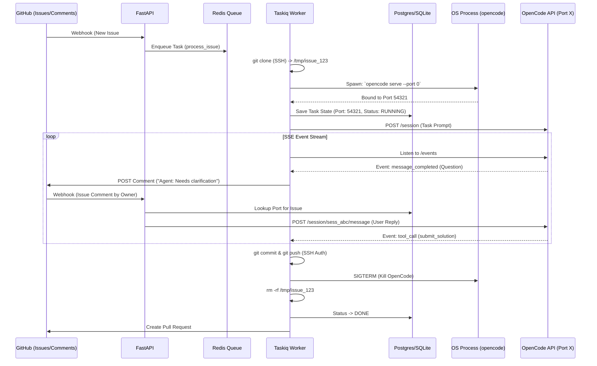

# 🤖 AI Coding Agent Orchestrator

## 📖 Project Description
The **AI Orchestrator** is an asynchronous Python service acting as a bridge between GitHub, Telegram, and isolated instances of the OpenCode agent. 

The system automatically reacts to new GitHub Issues. For each task, it performs an isolated `git clone`, dynamically spawns a dedicated OpenCode server process for that specific directory, and formulates the task. 
A key feature is **Two-Way GitHub Sync**: if the Agent has questions or needs clarification, it posts them as comments in the GitHub Issue. When the repository owner replies to the comment, the Orchestrator routes the answer back into the Agent's session.

### Key Business Logic
1. **Dynamic Environment Isolation:** For every task, a clean `git clone` is executed into `/tmp/workspaces/issue_123`. A dedicated `opencode serve --port 0` (dynamic port) process is spawned inside this directory, ensuring complete isolation of SSE events and sessions.
2. **Two-Way Communication:** Agent's text outputs (questions/clarifications) are published as GitHub Comments. Owner's replies trigger a webhook that feeds the text back into the active Agent session.
3. **Secure Git Auth:** Operations like `git push` use SSH keys injected via memory/env vars (`GIT_SSH_COMMAND`) to prevent leaking credentials into the workspace's `.git/config`.
4. **Completion Control:** The Agent is instructed to use a specific API structure or format (e.g., calling a custom tool or outputting a strict JSON marker) to explicitly signal `TASK_COMPLETED`. Manual verification of the PR is still required by the Owner.
5. **Resource Management & Concurrency:** 
   * A hard limit on concurrent OpenCode instances (e.g., `MAX_CONCURRENT_INSTANCES = 3`).
   * **Idle Timeout:** If an instance waits for a user reply on GitHub for too long (e.g., 12 hours), the Orchestrator gracefully aborts the session, kills the process, and frees up RAM, notifying the user via Telegram.
6. **Robust Cleanup:** Guaranteed teardown of processes and temporary files in a `finally` block, regardless of success, failure, or timeout.

---

## 🛠 Technical Specifications

| Component | Technology | Description |
| :--- | :--- | :--- |
| **Language** | Python 3.12+ | Strict typing, modern async features (`asyncio.timeout`). |
| **Package Manager** | `uv` | Dependency management via `pyproject.toml`. |
| **Web Server** | FastAPI + Uvicorn | Receives GitHub webhooks (Issues & Issue Comments). |
| **Task Queue** | Taskiq + Redis | Async execution. Controls concurrency via worker limits. |
| **Database** | SQLAlchemy 2.0 (async) | Stores state: `issue_number` -> `active_port`, `session_id`, `status`. |
| **Telegram Bot** | Aiogram 3.x | Orchestrator control panel. Alerts for timeouts and errors. |
| **OpenCode API & Process** | `asyncio.subprocess` + `httpx` | Spawns `opencode serve`, parses dynamic port, consumes SSE. |
| **Git Interaction** | `git` CLI via subprocess | Async calls with injected `GIT_SSH_COMMAND` for secure auth. |
| **Logging** | `structlog` | Structured JSON logs bound to `issue_number` and `session_id`. |

---

## 📊 Process Diagram (Mermaid)



---

## 📂 Project Structure (Clean Architecture)

```text
ai_orchestrator/
├── pyproject.toml              
├── app/
│   ├── main.py                 
│   ├── core/                   
│   │   ├── config.py           # App settings (MAX_INSTANCES, IDLE_TIMEOUT)
│   │   └── logger.py           
│   ├── domain/                 
│   │   ├── entities.py         
│   │   └── interfaces/         
│   │       ├── vcs.py          
│   │       ├── opencode.py     # IOpenCodeClient & IProcessManager
│   │       ├── notifier.py     
│   │       └── state.py        
│   ├── application/            
│   │   ├── use_cases/
│   │   │   ├── execute_task.py # Main loop (Spawn -> Prompt -> Cleanup)
│   │   │   └── handle_reply.py # Route GitHub comments to active OpenCode
│   ├── infrastructure/         
│   │   ├── vcs/
│   │   │   ├── git_cli.py      # Uses SSH Context Manager
│   │   │   └── github_api.py   # Posts comments & PRs
│   │   ├── opencode/
│   │   │   ├── client.py       # REST + SSE client
│   │   │   └── manager.py      # Subprocess lifecycle management
│   │   ├── telegram/
│   │   └── db/
│   └── presentation/           
│       ├── webhooks/
│       │   └── router.py       # GitHub webhook handlers
│       └── workers/
│           └── broker.py       # Taskiq setup
```

---

## ⚙️ Main Orchestrator Function (Application Layer)

File: `app/application/use_cases/execute_task.py`. 

```python
import asyncio
import structlog
from contextlib import AsyncExitStack

logger = structlog.get_logger()
IDLE_TIMEOUT = 12 * 3600 # 12 hours waiting for user reply

async def execute_coding_task(
    issue_number: int,
    issue_data: dict,
    git: ILocalGitClient,
    github: IGitHubClient,
    oc_manager: IOpenCodeProcessManager,
    db: IStateRepository,
    telegram: ITelegramNotifier
):
    workspace_path = f"/tmp/workspaces/issue_{issue_number}"
    branch_name = f"feature/issue_{issue_number}"
    
    # 1. Safe Execution Context (Guarantees Cleanup)
    async with AsyncExitStack() as stack:
        # Register cleanup: Delete folder
        stack.push_async_callback(git.cleanup_workspace, workspace_path)
        
        # Clone repository securely using SSH keys
        await git.clone_ssh(issue_data['repo_url'], workspace_path)
        await git.create_branch(workspace_path, branch_name)
        
        # 2. Spawn Isolated OpenCode Server
        # Register cleanup: Kill process
        oc_process = await oc_manager.spawn_server(workspace_path)
        stack.push_async_callback(oc_manager.kill_server, oc_process.pid)
        
        # Update DB with active port so Webhooks can route replies
        await db.set_active_instance(issue_number, oc_process.port, status="RUNNING")
        
        oc_client = oc_manager.get_client(oc_process.port)
        session_id = await oc_client.create_session(f"Issue #{issue_number}")
        
        # 3. Formulate Task & Start
        system_prompt = f"Task: {issue_data['title']}\n{issue_data['body']}\nIf you need help, ask a question. When done, output explicitly: [TASK_COMPLETED]."
        await oc_client.send_message(session_id, system_prompt)

        task_completed = False

        # 4. SSE Control Loop with Idle Timeout
        try:
            async with asyncio.timeout(IDLE_TIMEOUT):
                async for event in oc_client.listen_events():
                    name, data = event["event_name"], event["data"]

                    # Agent sends a message (e.g. asking a question)
                    if name == "message_completed" and not data.get("has_commands"):
                        text = data.get("text", "")
                        if "[TASK_COMPLETED]" in text:
                            task_completed = True
                            break
                        else:
                            # Forward question to GitHub Comments
                            await github.post_comment(issue_number, f"🤖 **Agent:**\n{text}")
                            await telegram.send_message(f"Agent asked a question in Issue #{issue_number}")
                            # The loop continues waiting. When the user replies on GitHub,
                            # a separate FastAPI endpoint will inject the reply into this session.
                            
                    elif name == "error":
                        await telegram.send_message(f"⚠️ OpenCode Error: {data.get('message')}")
                        break

        except TimeoutError:
            await github.post_comment(issue_number, "⛔️ **System:** Session aborted due to 12h idle timeout.")
            await telegram.send_message(f"⛔️ Task #{issue_number} killed (Idle Timeout).")
            return # ExitStack will trigger process kill and folder removal

        # 5. Finalization
        if task_completed:
            await git.commit_and_push_ssh(workspace_path, f"Fix #{issue_number}", branch_name)
            await github.create_pull_request(issue_number, branch_name)
            await db.set_active_instance(issue_number, port=None, status="DONE")
            await telegram.send_message(f"✅ Success! PR created for Issue #{issue_number}.")
            
    # <-- AsyncExitStack automatically executes `kill_server` and `cleanup_workspace` here.
```

---

## 🛣 Step-by-Step Development Plan

### Phase 1: Initialization, DB & Core Config
1. Run `uv init`. Configure `pyproject.toml`.
2. Scaffold Clean Architecture structure.
3. Configure settings: `MAX_CONCURRENT_INSTANCES` and `IDLE_TIMEOUT`.
4. Set up async SQLAlchemy. Models must include `TaskState` (stores `issue_number`, `active_port`, `session_id` for routing user replies).

### Phase 2: Secure Infrastructure & Process Management
1. **Git Client:** Implement `ILocalGitClient` using `asyncio.subprocess`. Use `GIT_SSH_COMMAND` environment variable injection so Git uses the host's SSH agent without touching `.git/config`.
2. **Process Manager:** Implement `IOpenCodeProcessManager`. It must execute `opencode serve --port 0`, read the stdout to capture the assigned port, and return a PID/Port object.
3. **Cleanup:** Implement the `AsyncExitStack` pattern to ensure `kill -9 <pid>` and `rm -rf /tmp/...` are bulletproof.

### Phase 3: OpenCode Client & GitHub Comments Sync
1. Implement `IOpenCodeClient` (REST + SSE) that accepts a dynamic port parameter.
2. Implement `IGitHubClient` for creating Pull Requests and posting comments.
3. Build the two-way sync logic in the use cases:
   * Parse Agent messages and push them to GitHub.
   * Create an Application service that takes a User's GitHub comment, looks up the active Port in the DB, and sends a `POST /session/.../message` to the Agent.

### Phase 4: FastAPI & Webhooks
1. Create `POST /webhook` endpoint. Validate GitHub HMAC signature.
2. Filter logic:
   * **Issue Opened:** Dispatch `execute_coding_task` to Taskiq.
   * **Issue Comment Created:** Verify author is Owner. If yes, dispatch `handle_reply_task` to send text to the Agent.

### Phase 5: Telegram Bot & Queue Control
1. Set up Aiogram bot (Owner ID filtering).
2. Configure Taskiq with Redis. Set Taskiq concurrency limits (`--workers`) according to `MAX_CONCURRENT_INSTANCES` config to prevent system overload.
3. Implement bot notifications (Errors, Timeouts, Success).

### Phase 6: E2E Testing & Deployment
1. E2E Test Flow: Open Issue -> Agent asks clarification -> Reply on GitHub -> Agent finishes -> Push & PR.
2. Test Failure modes: Manually crash the Agent, verify that the `finally` block successfully clears `/tmp` and kills processes.
