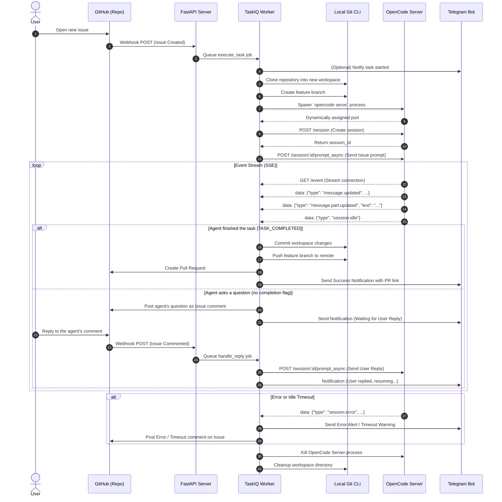

# Interaction Flow

This document illustrates the complete interaction lifecycle between GitHub, the OpenCode Agent, and the Telegram Bot as managed by the AI Coding Agent Orchestrator.

## Sequence Diagram

## Description of Key Steps

1. **GitHub Webhooks**: The system acts on two primary webhook events: `issues` (opened) and `issue_comment` (created).
2. **Asynchronous Processing**: The FastAPI server immediately acknowledges the webhook to GitHub and delegates the heavy lifting to TaskIQ workers.
3. **Isolated Workspaces**: Each task executes in a fresh `git clone` to guarantee that the `opencode` instance does not conflict with concurrent tasks or previous state.
4. **OpenCode Integration**: The worker interacts with the local `opencode` server exclusively via its exposed REST API (`/session`, `/session/:id/prompt_async`) and listens to the Server-Sent Events (`/event`) stream to parse the agent's response incrementally (`message.part.updated`).
5. **Interactive Loop**: The TUI-less agent session allows for a back-and-forth conversation. If the agent requires human clarification, its text is forwarded to GitHub as a comment. When the user replies, it's sent right back into the active agent session.
6. **Completion**: A successful run is explicitly signaled by the agent outputting `[TASK_COMPLETED]`. The system automatically wraps the changes up into a commit and opens a pull request.
7. **Telegram Control**: Throughout this lifecycle, the Telegram Bot serves as an active observer, providing real-time observability over timeouts, active process handling, user reply prompts, and final results.
