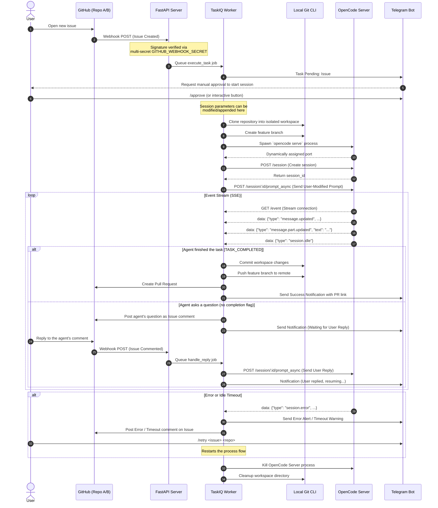

# Interaction Flow

This document illustrates the complete interaction lifecycle between GitHub, the OpenCode Agent, and the Telegram Bot as managed by the AI Coding Agent Orchestrator.

## Sequence Diagram

## Description of Key Steps

1. **GitHub Webhooks (Multi-Repo)**: The system supports an arbitrary number of repositories. Webhooks are verified using a comma-separated list of secrets in `GITHUB_WEBHOOK_SECRET`. Tasks are identified by a composite key of `issue_number` and `repo_url`.
2. **Asynchronous Processing**: The FastAPI server immediately acknowledges the webhook to GitHub and delegates task management to TaskIQ workers.
3. **Human-in-the-Loop (HITL)**: Agent sessions do not start automatically. The user must approve the task via Telegram. During this stage, the user can modify the request, append specific files to the prompt, or dictate which commands the agent should use.
4. **Isolated Workspaces**: Each task executes in a fresh `git clone` with a dedicated `opencode` instance on a dynamically assigned port to prevent cross-task contamination.
5. **OpenCode Integration**: The worker interacts with the local `opencode` server via its REST API (`/session`, `/session/:id/prompt_async`) and monitors progress via the Server-Sent Events (`/event`) stream.
6. **Interactive Feedback**: If the agent requires human clarification, its response is accumulated from `message.part.updated` events and posted to GitHub. Human replies are injected back into the active agent session.
7. **Persistence & Observability**: All task states are stored in a database. Users can monitor active tasks via `/list`, view logs via `/logs`, and recover from failures using `/retry` or `/cancel`.
8. **Completion**: Upon detecting the `[TASK_COMPLETED]` marker, the orchestrator automatically commits the changes, pushes the branch, and creates a Pull Request on the target repository.
